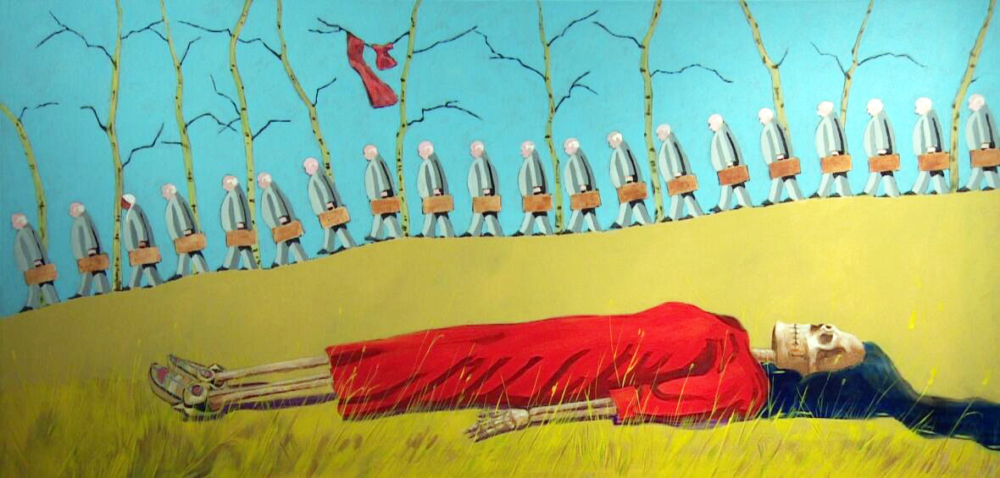
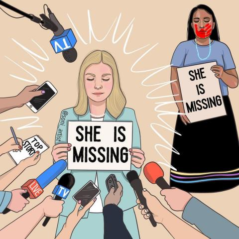
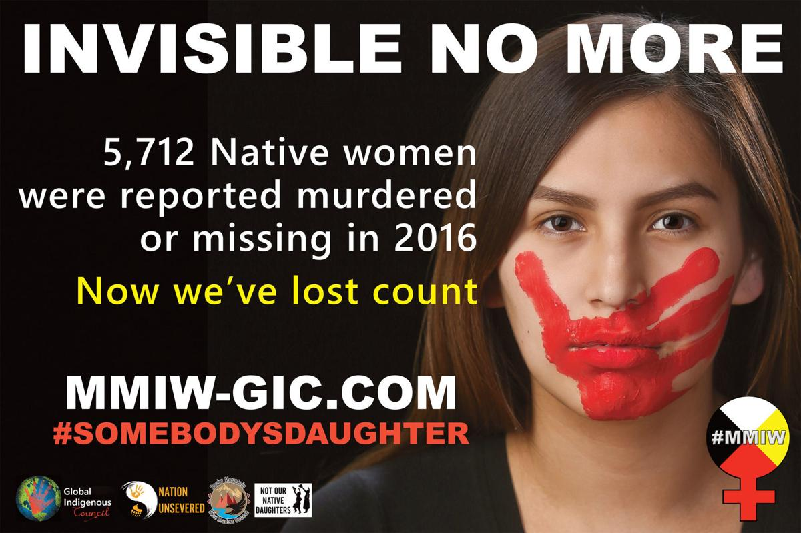
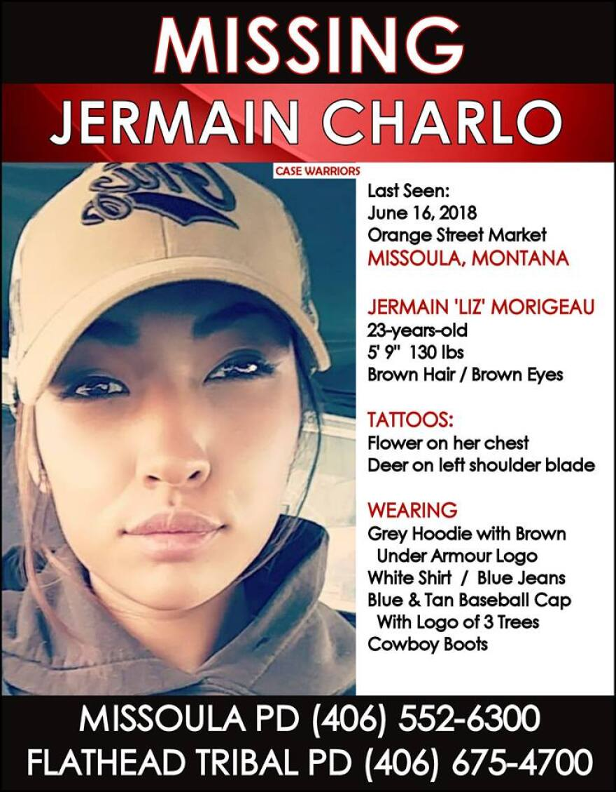
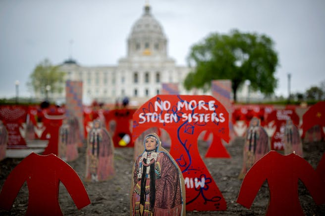

Again images continue to be my issue. I am not sure where to incert them in the code.

Images and Content to add

Ripples of Loss, by Terry McCue
“Alberta artist Terry McCue was so moved the first time he heard about the REDress movement, he was inspired to come up with his own tribute to missing and murdered Indigenous women and girls. A year and a half later, the Ojibway painter has a series of 16 works, making up the exhibit Ripples of Loss. “This is the most important work in my career,” said McCue, 72.”
https://www.cbc.ca/news/canada/edmonton/missing-and-murdered-indigenous-women-exhibit-edmonton-1.4405060

She is Missing, by
Soni Lopez-Chavez
"Every single person that is missing deserves the same attention and care given to their case," says artist Soni Lopez-Chavez. "Her life matters just as much as the next. Bring them home. All of them. Sending prayers to all the families."
https://fronterasdesk.org/content/1720491/everyone-was-talking-about-gabby-petito-indigenous-womens-cases-still-go-ignored

© 2018-2021 by Global Indigenous Council
Global Indigenous Council's Billboard image for their MMIW Campaign 
https://www.globalindigenouscouncil.com/missing-murdered-p1

Case Warriors For The Missing/Facebook
Missing Woman Jermain Austin Charlo
https://www.facebook.com/CaseWarriorsForTheMissing/

ELIZABETH FLORES, STAR TRIBUNE
An art installation from Artists C3 was placed in front of the Capitol for Missing and Murdered Indigenous Women and Girls Awareness Day at the Minnesota Capitol in St. Paul, on May 5, 2021.
https://www.startribune.com/the-effort-to-end-violence-against-indigenous-women-and-girls-one-year-later/600117077/
